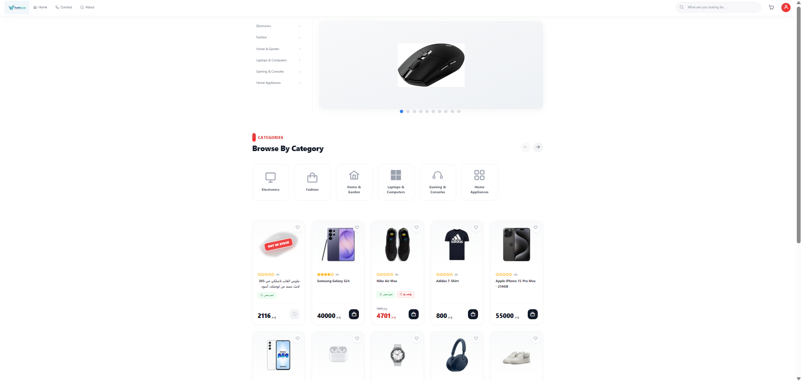
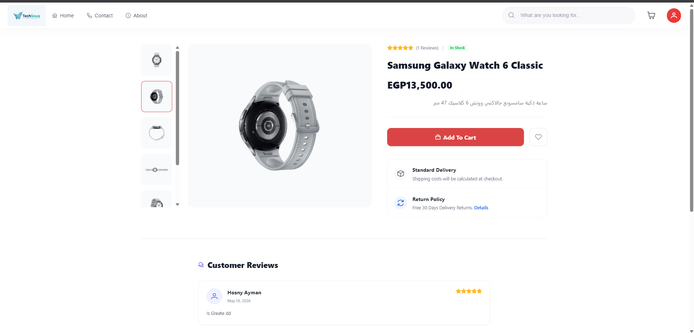
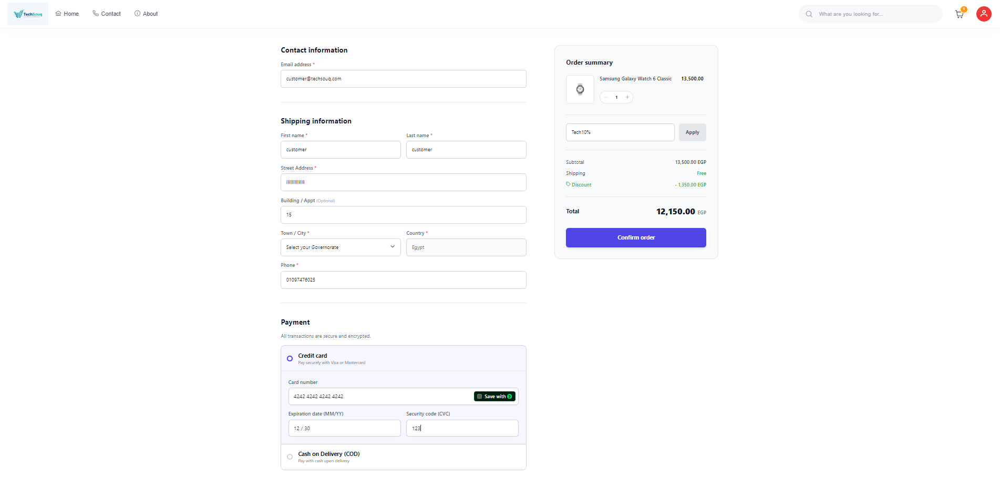

# TechSouq Client Storefront 🛒

A high-performance, responsive, and SEO-optimized e-commerce storefront built with **Angular 17 (SSR)** and **PrimeNG**. This repository represents the client-facing application of TechSouq, providing consumers with a seamless shopping experience from product discovery to secure online payment.

🚀 **Live Storefront:** [tech-souq-client.vercel.app](https://tech-souq-client.vercel.app/Home)

## 🔐 Live Demo & Testing

To fully experience the shopping and checkout flow, you can use the following demo customer account:
* **Email:** `customer@techsouq.com`
* **Password:** `Customer123!`

Credit card Info For Testing Payment Stripe
* **Card number:** `4242 4242 4242 4242`
* **Expiration date (MM/YY):** `12/30`
* **Security code (CVC):** `123`

🎁 **Test our Coupon Engine!**
During checkout, try applying these active promo codes to see dynamic price recalculations:
* `Tech10%` - Applies a 10% discount on your cart.
* `Tech5%` - Applies a 5% discount.
* `Tech50` - Deducts exactly 50 EGP from the total.
* `Tech100` - Deducts exactly 100 EGP from the total.

## 📸 System Previews

*(Place your screenshots here by replacing the paths once uploaded)*




## 🏗️ Architecture & Performance Optimization
* **Server-Side Rendering (Angular SSR):** Deployed with `@angular/ssr` to ensure blazing-fast initial load times, optimal performance, and robust SEO capabilities for search engine indexing.
* **Reactive State Management:** Leveraging **RxJS Declarative Streams** to handle real-time shopping cart state updates globally across the navigation bar and layout components.
* **Server-Side Pagination & Filtering:** Fully optimized product feeds fetching data incrementally based on category parameters and text search queries to reduce network overhead.

## 🔐 Advanced Engineering & Business Features

### 🔄 1. Guest-to-Authenticated Cart Migration
* Implemented a smart synchronization pipeline: Unauthenticated guests can manage their cart locally via `LocalStorage`. 
* Upon successful authentication (**JWT Credentials or Google OAuth 2.0**), a background reconciliation service automatically migrates the local cart items to the remote SQL database, merging states seamlessly.

### 📍 2. Dynamic Multi-Address Management System
* Users can store and modify up to **5 different shipping addresses** within their profile settings.
* Features a dynamic state handler allowing users to designate a **Default Address**, which is automatically fetched and prioritized during the checkout sequence.

### 💳 3. Enterprise Checkout & Payment Flow
* Fully integrated **Stripe Payment Gateway** utilizing `@stripe/stripe-js` for tokenization and secure credit card payments.
* Supports **Cash on Delivery (COD)** as an alternative payment workflow.
* Strict transactional logic: Inventory stock automatically and securely synchronizes (decreases) upon order fulfillment (`Delivered` status trigger).

### 🎫 4. Conditional & Complex Coupon Engine
* Client-side validation for multi-tier promotion codes (Percentage-based vs. Fixed-amount).
* Handles complex exclusion business rules, such as coupons strictly limited to products that *do not* already qualify for Free Shipping.

### 💬 5. Interactive Review & Rating System
* Customers who purchased products can leave verified comments and interactive star ratings.
* Features reactive full inline editing capabilities for updating existing reviews.

### 🔑 6. Account Recovery & Security
* Integrated `@abacritt/angularx-social-login` for single-click secure Google Login.
* Secure self-service password recovery utilizing tokenized verification links sent directly to the user's Gmail.
* Full profile management options allowing names, passwords, and addresses updates securely.

## 🛠️ Core Tech Stack

* **Framework:** Angular v17 (with SSR & Animations)
* **UI Component Library:** PrimeNG v17 & PrimeIcons
* **Styling:** Tailwind CSS v3 (with PostCSS & Autoprefixer)
* **Loading States:** Deployed `ngx-spinner` for elegant global async operation overlays.
* **State & Async Utilities:** RxJS Observables / Subjects pipeline.

## ⚙️ How to Run Locally

1. Clone the repository: `git clone https://github.com/YOUR_USERNAME/TechSouq-Frontend.git`
2. Install dependencies: `npm install`
3. Start the development server with SSL bypass configurations for local backend testing:
   ```bash
   npm start